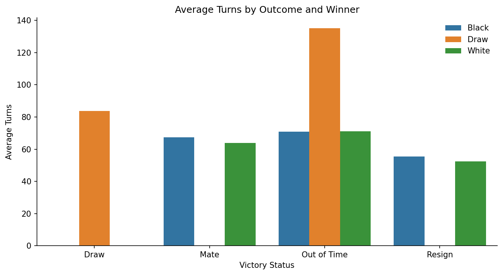
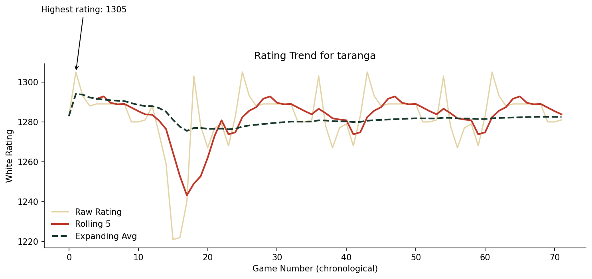
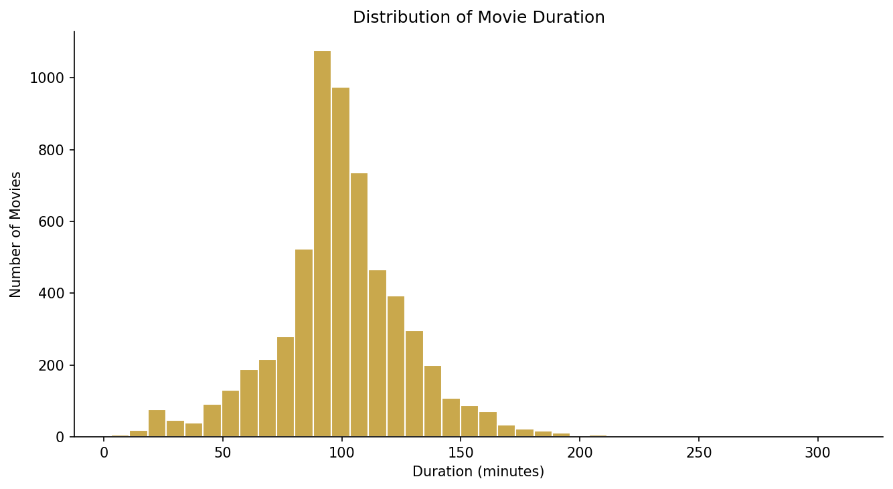
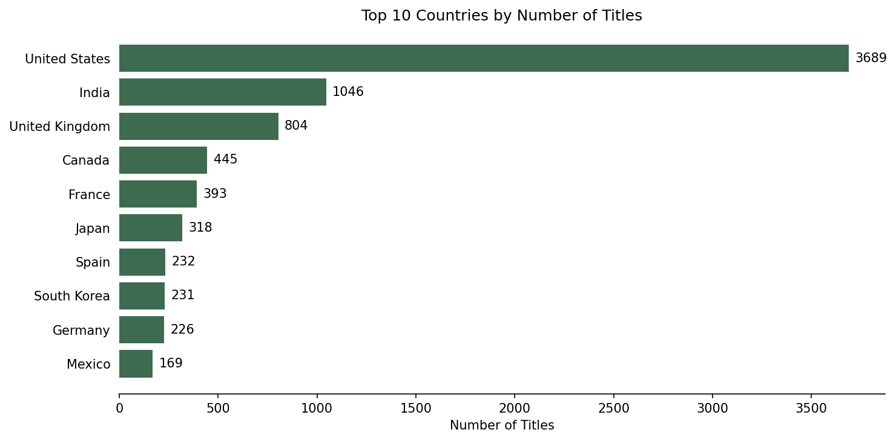
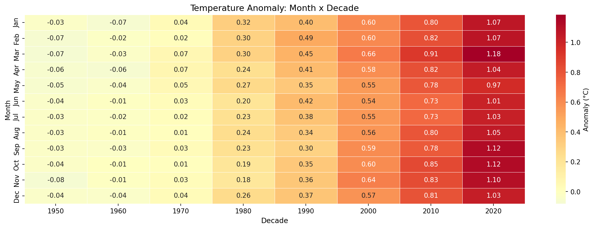
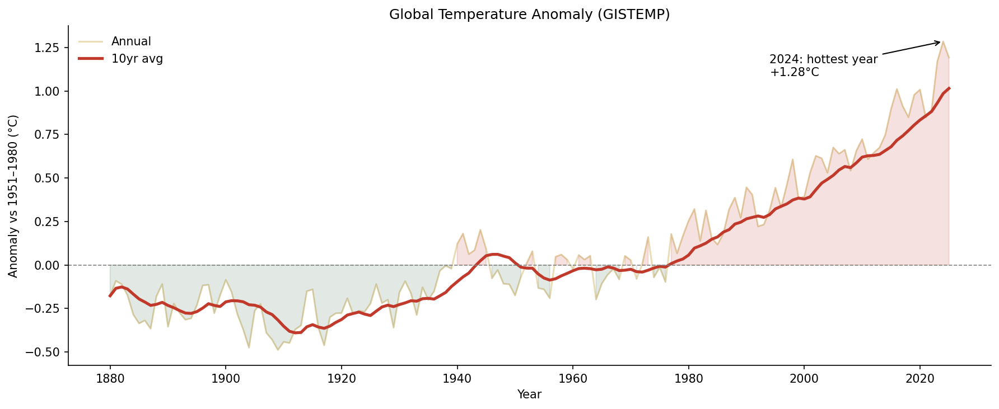

# Chess Game Pipeline — Data Quality Report

## Project Structure
```
Chess_game/
├── README.md
├── data/
│   └── raw/
│       ├── chess_games.csv
│       └── player_registry.csv
├── notebooks/
│   └── 01_explore.ipynb
├── src/
│   ├── fetch_data.py
│   └── clean_chess.py
└── output/
    ├── wins_by_color.png
    ├── white_rating_vs_turns.png
    └── turns_by_victory_status.png
```

---

## Dataset 1: chess_games.csv

### Shape
- **Raw:** 20,058 rows × 17 columns
- **After cleaning:** 20,058 rows × 19 columns (2 added, 1 dropped)

### Null Analysis
| Column | Null % |
|--------|--------|
| `opening_response` | 93.98% |
| `opening_variation` | 28.21% | 
| All others | 0% |

### Cleaning Decisions (Stage 2)
| Step | Action | Why |
|------|--------|-----|
| 2a | Split `time_increment` → `time_base` + `time_inc` | Raw format "15+2" is not usable for analysis |
| 2b | Added `rating_diff = white_rating - black_rating` | Needed to measure player strength gap; positive = White stronger, negative = Black stronger |
| 2c | Extracted `opening_family` from `opening_fullname` | Reduces 400+ opening names to 227 families for cleaner analysis |
| 2d | Dropped `opening_response` | 93.98% null — no analytical value |
| 2e | Flagged `is_suspicious` where `turns < 5` | 342 games are abnormally short — possible forfeits or errors |

### Validation
-  0 duplicate rows
-  No nulls in `rating_diff`
-  1,138 games share duplicate move sequences (kept — different games can follow same opening)

---

## Dataset 2: player_registry.csv

### Shape
- 9 columns: `username`, `display_name`, `country`, `registered_year`, `rating_registry`, `total_games_registry`, `account_status`, `email_verified`, `join_platform`

### Null Analysis
| Column | Null % | Decision |
|--------|--------|----------|
| `country` | ~5% | ✅ Kept as NaN — cannot infer country |
| All others | 0% | ✅ No action needed |

### Cleaning Decisions
| Step | Action | Why |
|------|--------|-----|
| Country standardization | Mapped 19 inconsistent values → 10 unified country names | Same country appeared in multiple formats |

### Country Inconsistencies Fixed (19 total)
| Raw Values | Standardized To |
|------------|----------------|
| `RUS`, `russian federation` | `Russia` |
| `US`, `USA`, `united states` | `United States` |
| `UA` | `Ukraine` |
| `BRA`, `brazil` | `Brazil` |
| `GB`, `UK`, `united kingdom` | `United Kingdom` |
| `DE`, `Deutschland` | `Germany` |
| `FR`, `france` | `France` |
| `PL`, `poland` | `Poland` |
| `IN` | `India` |
| `ES` | `Spain` |

---

## Merge Decision

| Property | Value |
|----------|-------|
| Join type | Left join |
| Join key | `white_id = username` |
| Why Left? | Keep all chess games even if player has no registry entry |
| Result shape | 20,058 rows × 6 columns |

### Q16 Result
- **9,251 unique white players** had no registry entry (~46% of white players)

---

## Key Findings

### Stage 2
| Question | Answer |
|----------|--------|
| Q7: Higher-rated player win rate | **64.6%** of non-draw games |
| Q8: Suspicious games (< 5 turns) | **342 games** |
| Q9: Unique opening families | **227 families** |

### Stage 3
| Question | Answer |
|----------|--------|
| Q10: Win rates | White: 49.9% / Black: 45.4% / Draw: 4.7% |
| Q11: Most common victory status | **Resign** |
| Q12: Highest avg turns by status | **Draw** (~84 turns) |
| Q13: Top opening when White wins | **Sicilian Defense** |
| Q13: Top opening when Black wins | **Sicilian Defense** |
| Q14: Rated White win rate | ~49.84% / Unrated: ~49.94% |
| Q15: Game length distribution | Long > Medium > Short |

### Stage 4 — Plots
| Plot | File | Observation |
|------|------|-------------|
| Win counts by color | `wins_by_color.png` | White wins most, Draw is rare |
| White rating vs turns | `white_rating_vs_turns.png` | Most games end in 25–120 turns; outliers reach 350 |
| Turns by victory status | `turns_by_victory_status.png` | Draw = longest, Resign = shortest |

# Part 2 — Database Schema (Assignment 6)

## Table 1: `players`
| Column | Type | Constraints | Why |
|--------|------|-------------|-----|
| `username` | TEXT | PRIMARY KEY NOT NULL | Unique identifier for each player |
| `last_rating` | INTEGER | NOT NULL | Player's most recent rating |
| `total_games` | INTEGER | NOT NULL DEFAULT 0 | Total games played as white or black |

**Rows:** 15,635 unique players

---

## Table 2: `openings`
| Column | Type | Constraints | Why |
|--------|------|-------------|-----|
| `opening_code` | TEXT | PRIMARY KEY NOT NULL | Unique ECO code per opening |
| `opening_shortname` | TEXT | NOT NULL | Short display name |
| `opening_fullname` | TEXT | NOT NULL | Full name including variation |

**Rows:** 365 unique openings

**Why separate table?** `opening_fullname` depends only on `opening_code`, not on `game_id` → 2NF violation → separated.

---

## Table 3: `games`
| Column | Type | Constraints | Why |
|--------|------|-------------|-----|
| `game_id` | INTEGER | PRIMARY KEY NOT NULL | Unique identifier per game |
| `white_id` | TEXT | NOT NULL, FK → players(username) | Links white player to players table |
| `black_id` | TEXT | NOT NULL, FK → players(username) | Links black player to players table |
| `winner` | TEXT | NOT NULL, CHECK(winner IN ('White','Black','Draw')) | Prevents invalid winner values |
| `victory_status` | TEXT | NOT NULL | How the game ended |
| `turns` | INTEGER | NOT NULL, CHECK(turns >= 1) | Prevents 0 or negative turn counts |
| `time_increment` | TEXT | NOT NULL | Raw time control string |
| `rated` | INTEGER | NOT NULL, CHECK(rated IN (0,1)) | Boolean: 1=rated, 0=unrated |
| `opening_code` | TEXT | NOT NULL, FK → openings(opening_code) | Links game to openings table |
| `white_rating` | INTEGER | NOT NULL | Deliberate denormalization for analytical convenience |
| `black_rating` | INTEGER | NOT NULL | Deliberate denormalization for analytical convenience |

**Rows:** 20,058 games

---

## Why Each FK Exists
| FK | Protects Against |
|----|-----------------|
| `white_id → players(username)` | Can't insert a game for a player that doesn't exist |
| `black_id → players(username)` | Both sides of the game must be registered players |
| `opening_code → openings(opening_code)` | Can't insert a game with an unknown opening code |

---

## Why Each CHECK Constraint Exists
| CHECK | Protects Against |
|-------|-----------------|
| `winner IN ('White','Black','Draw')` | Prevents typos like 'white', 'WIN', or NULL |
| `turns >= 1` | Prevents 0-turn or negative games |
| `rated IN (0,1)` | Enforces boolean — prevents values like 2 or -1 |

---

## Indexes
```sql
CREATE INDEX idx_games_white   ON games(white_id)
CREATE INDEX idx_games_black   ON games(black_id)
CREATE INDEX idx_games_opening ON games(opening_code)
CREATE INDEX idx_games_winner  ON games(winner)
```
**EXPLAIN QUERY PLAN confirms:**
```
SEARCH games USING INDEX idx_games_white (white_id=?)
```

---

## ERD
```
players ──────────────────── games ──────── openings
(username PK)    white_id FK ──┘  └── opening_code FK    (opening_code PK)
                 black_id FK ──┘
```

---

## Normalisation
| NF | Applied | Example |
|----|---------|---------|
| 1NF | ✅ | All columns atomic |
| 2NF | ✅ | `opening_fullname` moved to `openings` table |
| 3NF | ✅ | `rating_tier` computed at query time, not stored |

> **Deliberate denormalization:** `white_rating` and `black_rating` kept in `games` for analytical convenience.

---

## Assignment Answers
| Q | Answer |
|---|--------|
| A1: Highest Draw rate opening | E32 — 33.33% draw rate |
| A2: More Black wins than White | taranga (38 black vs 34 white) |
| A3: Most common opening per victory_status | A00 dominates all statuses |
| A4: Top opening family by avg turns | King's Indian Defense (70.79 avg turns) |
| A5: Game ranks | saved to `data/processed/game_ranks.csv` |
| Feature table | saved to `data/processed/features.csv` — 20,058 rows × 7 cols |


# Visual Research Report — Findings

## Finding 1 — Chess: Draw games last significantly longer than decisive games
Draw games average around 84 turns, compared to roughly 50-55 for resignations
and 60-67 for checkmates. This nearly 50% gap shows that games heading toward
a draw involve prolonged maneuvering, often in endgames where neither side can
force a breakthrough. Decisive outcomes happen faster — either through
tactical errors leading to resignation or forced mates. The pattern holds
across both Black and White, suggesting it is a structural feature of how
draws arise (repetition or insufficient material) rather than a colour-specific
effect.


## Finding 2 — Chess: Individual player ratings show short-term volatility but a stable long-term trend
For the player "taranga", the rolling 5-game average swings noticeably between
roughly 1240 and 1300, while the expanding average stays close to a narrow
1280-1295 band throughout the entire game history. The player's peak rating of
1305 occurred early in their recorded games. This shows that short-term form
(rolling average) can dip or spike significantly from game to game, while the
career-long average (expanding) remains far more stable — a useful distinction
when evaluating whether a player is "on a streak" versus their true skill
level.



## Finding 3 — Netflix: Movie catalogue is dominated by mid-length films
The histogram of movie durations shows a clear peak around 90-110 minutes,
with the distribution tapering off sharply for both very short films (under
60 minutes) and very long ones (over 150 minutes). This reflects standard
theatrical and streaming conventions, where Netflix's acquisition and
production choices favour the commercially familiar feature-length format
rather than experimental short or extended-length content.



## Finding 4 — Netflix: Content production is heavily concentrated in the US and India
The United States leads with 3,689 titles, more than triple India's count of
1,046, with the United Kingdom a distant third at 804. This concentration
reflects Netflix's content strategy: the US as its home market with the
largest production infrastructure, and India representing the platform's
strategy to license large volumes of Bollywood and regional content to serve
its international subscriber base rather than relying solely on original
production. Beyond the top 3, counts drop sharply (Canada at 445, France at
393), showing content production is dominated by a small number of major
markets.


## Finding 5 — Global temperature anomalies have risen sharply and consistently since 1950
The temperature heatmap (month x decade) shows anomalies were near zero or
slightly negative through the 1950s-1970s across all months, but every decade
since then shows a steady increase across every single month, with the 2020s
reaching 1.0-1.2°C above baseline in nearly all months. The annual time series
confirms this: the 10-year rolling average has climbed steadily, with 2024
recording the highest annual anomaly on record at roughly +1.28°C. The fact
that warming appears consistently in every month, not concentrated in any
particular season, indicates this is a systemic shift in the climate baseline
rather than a seasonal artefact.



